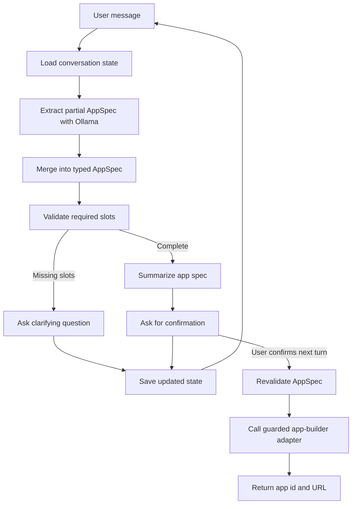

# AI Chatbot v2

TypeScript app-building chatbot that gathers requirements, asks clarifying questions, confirms the final app spec, and then calls a guarded app-builder adapter.

The app uses local Ollama through the Ollama HTTP API. It does not use LangChain or LangGraph.

## Slot-Filling Chatbot Concept

This project treats app creation as a slot-filling workflow. Instead of letting the LLM freely decide when an app is ready to build, the backend keeps a typed `AppSpec` and fills it over multiple chat turns.

Each slot is a structured requirement the app builder needs, such as:

- `appType`: dashboard, workflow, CRUD app, chatbot, portal, or other
- `purpose`: what business problem the app solves
- `targetUsers`: who will use the app
- `coreFeatures`: the capabilities the app must provide
- `dataEntities`: the records or objects the app needs to manage
- `authRequired`: whether access control is required for templates that need that decision

On every message, the chatbot extracts only the requirements supported by the user's latest message, merges those values into the existing conversation state, validates which required slots are still missing, and asks focused follow-up questions. When all required slots are present, it summarizes the interpreted app spec and waits for explicit confirmation before calling the app builder.



The important design choice is that the LLM helps with language tasks, while application code owns the workflow rules.

| LLM responsibility | Application responsibility |
| --- | --- |
| Extract possible requirements from natural language | Define the `AppSpec` schema |
| Phrase concise clarifying questions | Decide which fields are required |
| Summarize the completed plan for confirmation | Merge, validate, and persist state |
| Classify ambiguous confirmation replies | Prevent app creation until validation and confirmation pass |

This keeps the implementation transparent and testable. The chatbot can be conversational, but the final app-builder request always comes from validated structured state rather than raw chat history.

## Prerequisites

- Node.js 20+
- npm
- Ollama installed and running locally
- The `gemma4:latest` model pulled into Ollama

## Setup

```bash
npm install
cp .env.example .env
ollama pull gemma4:latest
```

The default model is:

```text
gemma4:latest
```

The Ollama endpoint defaults to `http://localhost:11434`. If Ollama is running elsewhere, set `OLLAMA_BASE_URL` in your `.env`. You can also change `OLLAMA_MODEL` there if you want to try a different local model.

The local UI shows estimated context used over the configured model context window. Override the maximum with `OLLAMA_CONTEXT_WINDOW_TOKENS` when using a model with a different limit. The used value is estimated from server-side conversation state and current structured app spec, so provider token accounting may differ slightly.

Context window handling is enforced on the backend:

- Below `OLLAMA_CONTEXT_WINDOW_WARNING_RATIO`, the badge stays neutral and chat continues normally.
- At or above `OLLAMA_CONTEXT_WINDOW_WARNING_RATIO` (default `0.8`), the badge changes to a warning state. If enough old messages exist, the backend compacts older transcript messages into the current structured app spec and keeps the latest turns.
- At or above `OLLAMA_CONTEXT_WINDOW_BLOCK_RATIO` (default `0.95`), new LLM requirement extraction is paused to avoid silently dropping context. The current spec remains saved, and the UI disables the composer until the user starts a new conversation or the configured context window is increased.
- Deterministic confirmation replies, such as a clear `yes` or `no` while the bot is awaiting confirmation, can still be handled without an LLM call.

Tune these settings in `.env`:

```text
OLLAMA_CONTEXT_WINDOW_TOKENS=256000
OLLAMA_CONTEXT_WINDOW_WARNING_RATIO=0.8
OLLAMA_CONTEXT_WINDOW_BLOCK_RATIO=0.95
```

Ollama calls use bounded retry with exponential backoff for transient service errors such as throttling, request timeouts, and 5xx responses. Tune these settings in `.env`:

```text
OLLAMA_RETRY_ATTEMPTS=3
OLLAMA_RETRY_BASE_DELAY_MS=250
OLLAMA_RETRY_MAX_DELAY_MS=2000
```

The service emits structured Pino events for chat turns, requirement extraction, missing fields, confirmation decisions, app-builder calls, and retry scheduling. Metric-style log records are emitted for turn latency, started conversations, clarification questions, confirmation decisions, app creation outcomes, LLM request failures, and structured-output repair failures. The local service also keeps process-local in-memory metrics and exposes them through `GET /api/metrics`; the right-side UI panel polls that endpoint while the server is running.

## Run

```bash
npm run dev
```

Open `http://localhost:3000` for the minimalist local UI.

## API

```http
POST /api/chat
Content-Type: application/json

{
	"conversationId": "conv_123",
	"userId": "local-user",
	"message": "Build me a sales app."
}
```

```http
GET /api/metrics
```

`/api/metrics` returns counters since the current server process started, including chat turns, extraction failures, confirmation decisions, app creation outcomes, and average turn/app-builder latency.

## Scripts

- `npm run dev` starts the Fastify service with `tsx`.
- `npm run build` compiles TypeScript and copies the UI assets.
- `npm run start` runs the compiled service.
- `npm run test` runs the Vitest suite.
- `npm run typecheck` runs TypeScript validation.
- `npm run lint` runs ESLint.

## Current Scope

- In-memory conversation state.
- Local Ollama chat API adapter with bounded transient retry.
- Zod-validated app spec and state schemas.
- Deterministic required-field validation.
- Mock app-builder adapter that records create requests.
- Structured workflow events, metric-style logs through Pino, and process-local `/api/metrics` counters.
- Minimal local web UI for manual testing.